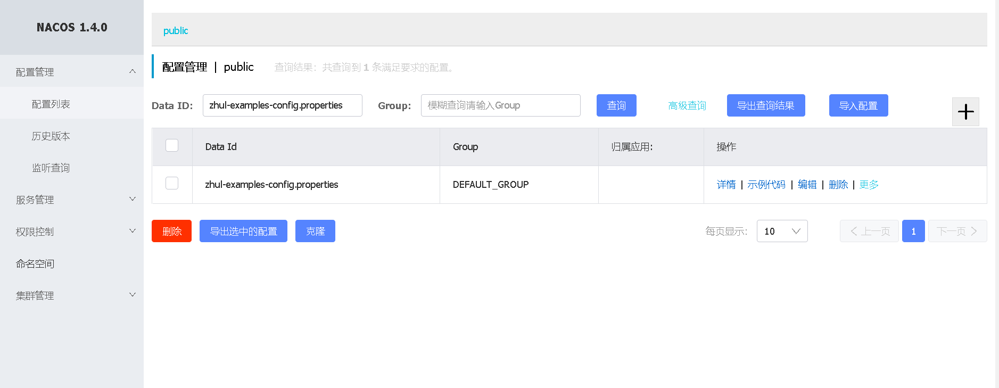
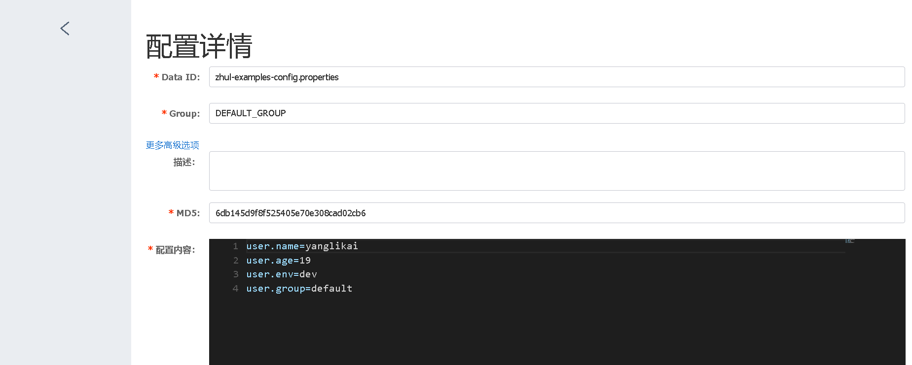

# zhul-examples-config

## 项目说明

本项目演示如何集成配置中心。

## 示例

### 接入准备

1. 接入前需先部署Nacos配置中心

2. 在配置中心创建如下配置：

  + 
  + 
 

### 如何接入

1. 首先，修改 `pom.xml` 文件， 引入 zhul-framework-starter-service。

````
		<dependency>
        <groupId>com.zhul.cloud</groupId>
        <artifactId>zhul-framework-starter-service</artifactId>
		</dependency>
````

2. 添加注解

```java
@EnableZhulService
public class ZhulExamplesConfigApplication {

	public static void main(String[] args) {
		SpringApplication.run(ZhulExamplesConfigApplication.class, args);
	}

}
```

3. 修改 `bootstrap.properties` 文件

```
spring.application.name=zhul-examples-config

# 启用开关|消息组件
zhul.cloud.stream.enabled=false

# 启用开关|缓存组件
zhul.cloud.cache.enabled=false

# 启用开关|分布式锁组件
zhul.cloud.lock.enabled=false

# 启用开关|防护组件
zhul.cloud.protector.enabled=false

# 启用开关|分布式事务组件
zhul.cloud.transaction.enabled=false

# 启用开关|数据库组件
zhul.cloud.database.enabled=false

```

修改 `application.properties` 文件

```
server.port=8010
```

*框架层面已内置了最佳配置

### 应用启动

跟原生的Spring Boot应用程序启动方式一致

### 示例验证

控制台日志输出如下配置

```
[user name :yanglikai; age: 19;env:dev;group:default]
```